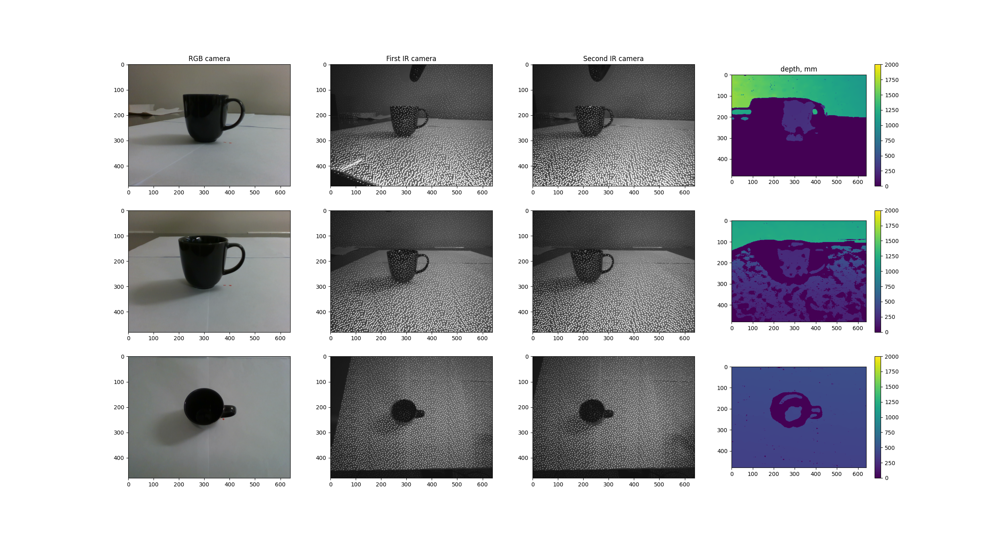
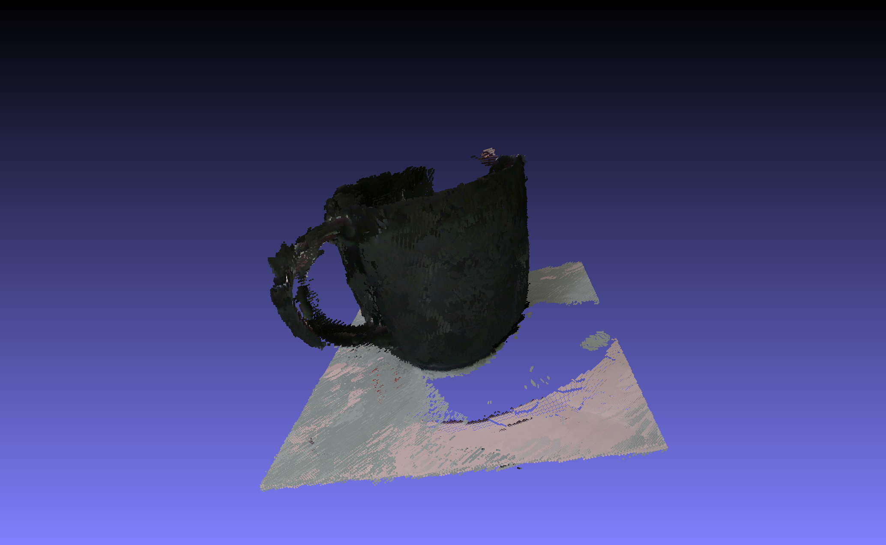
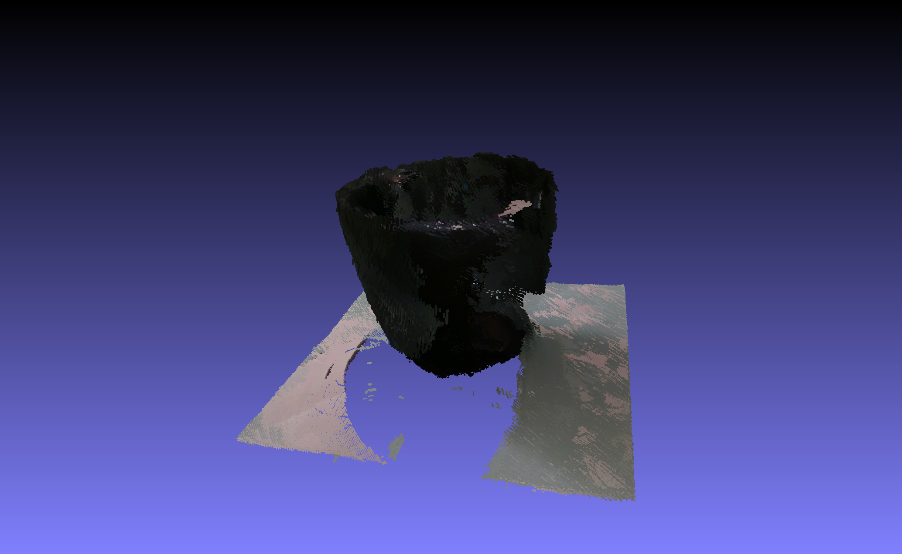
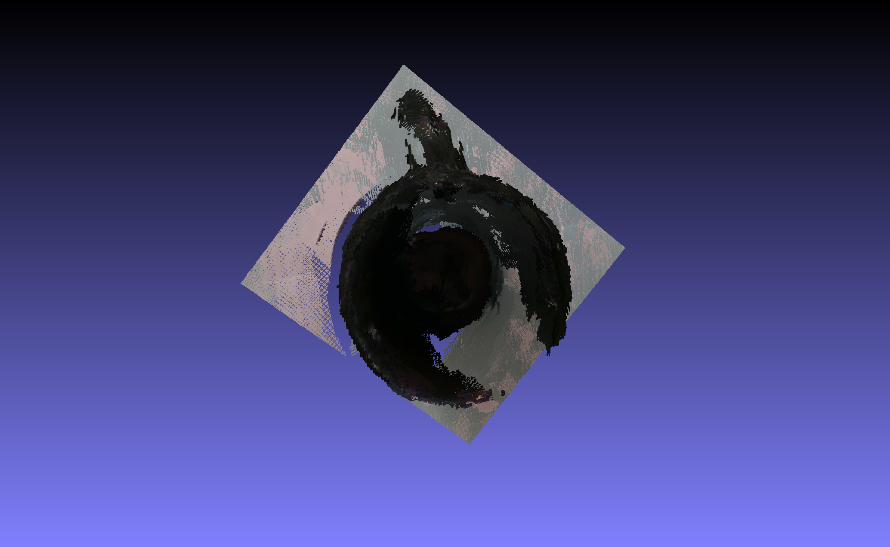

# 3d cup reconstruction
It was a test. The interviewer allows me to put part of the result into public access.  
The task is to recunstuct 3d cup from a RGB-D sensor.  
The sensor scans the cup from different points fo view.  
There are about 200 scans.    
Here is the examples of the scan:    
  
Depth data is calculated from IR images inside the sensor.  
Also there is a txt file with the sensor position and orentation.  
Aslo camera calibration matrix is known.  

#### Result of the reconstuction:  
  
  
  
  
  


#### Usage
To run the code use:  
```python3 main.py path_to_dataset```  
As result it makes point clounds in .ply ascii files.  
Then using [MeshLab](https://www.meshlab.net/) I combined point clouds into one cloud.   
Sensor position and orientation data was not precise so point clouds algiment was neccesary.  
MeshLab's [ICP](https://en.wikipedia.org/wiki/Iterative_closest_point) was used to align point clouds.  
How I combined the point clouds with the MeshLab:  
1) Add ply files: File → import mesh  
2) Add normals: Filters → Normals, Curvatures and Orientation → compute normal for point set  
3) Push A button (align)  
4) Push glue here visible meshes  
5) Choose and push Set as Base Mesh  
6) Push Set ICP params for mm  
7) Push Edit Default ICP Parameters…  
8) Set Sample number to 20000  
9) Push process  
10) Close align widow  
11) Right click on a layer and Flatten visible layers  
12) Set Keep referenced vertices, push apply  

Also I tried a [ICP python code](./icp.py) but it works bad. So I used MeshLab's ICP


  


